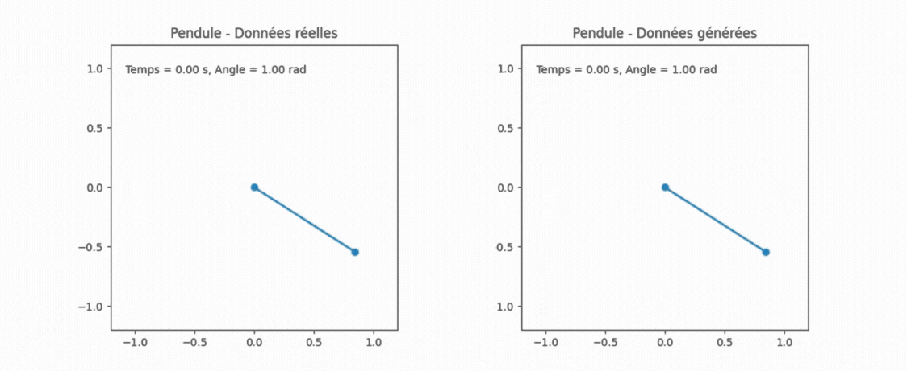

# Genetic Equation Discovery

My goal was to explore machine learning equation discovery in the context of physics simulations.
This project uses genetic programming to discover mathematical equations from data, with a focus on symbolic regression using the `gplearn` library. Example datasets and scripts are provided for experimentation and demonstration.

Here’s a GIF showcasing one of the results I obtained:



On the left, you can see a physically accurate pendulum simulated with its true physics equation. On the right, you see the formula automatically generated by `gplearn`.

## Project Structure

```
├── datasets/                # Example datasets (CSV)
├── exemples/                # Example scripts (e.g., pendulum.py)
├── output/                  # Output files (plots, gifs, etc.)
├── src/                     # Source code (dataset generation, discovery)
├── README.md                # Project documentation
```

## Installation

1. Clone the repository:
   ```bash
   git clone https://github.com/AngelLagr/genetic-eq-discovery.git
   cd genetic-eq-discovery
   ```
2. Install dependencies: 
   ```bash
   pip install numpy pandas gplearn scikit-learn
   ```

## Usage

To run the pendulum example and discover equations using genetic programming:

```bash
python -m examples.pendulum
```

This command runs the script as a module, ensuring imports work correctly.

## License

Apache 2.0
